# Hermes Agent — Architecture Document

> **Last updated:** April 2026

## Table of Contents

- [1. Overview](#1-overview)
- [2. High-Level Architecture](#2-high-level-architecture)
- [3. Entry Points](#3-entry-points)
- [4. Core Agent Loop](#4-core-agent-loop)
- [5. Tool System](#5-tool-system)
- [6. Agent Internals](#6-agent-internals)
- [7. CLI Subsystem](#7-cli-subsystem)
- [8. Gateway & Messaging Platforms](#8-gateway--messaging-platforms)
- [9. State & Persistence](#9-state--persistence)
- [10. Supporting Systems](#10-supporting-systems)
- [11. Configuration](#11-configuration)
- [12. Data Flow — Message Lifecycle](#12-data-flow--message-lifecycle)
- [13. Key Architectural Patterns](#13-key-architectural-patterns)
- [14. Extension Points](#14-extension-points)

---

## 1. Overview

Hermes Agent is a modular, multi-platform AI agent framework built on top of
the OpenAI-compatible chat completions API. It supports tool-calling loops,
multiple LLM providers, persistent memory, interactive CLI, messaging gateway
integration (Telegram, Discord, Slack, etc.), batch processing, RL training
environments, and an extensible plugin/skill system.

The project is written in Python and follows a **self-registration** pattern
for tools, a **callback-driven** architecture for UI integration, and a
**profile-isolated** configuration model for multi-instance deployments.

---

## 2. High-Level Architecture

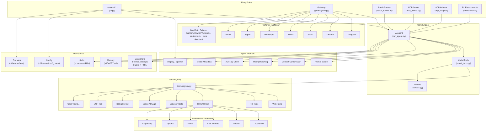

---

## 3. Entry Points

Hermes Agent supports multiple entry points, all converging on the same
`AIAgent` core.

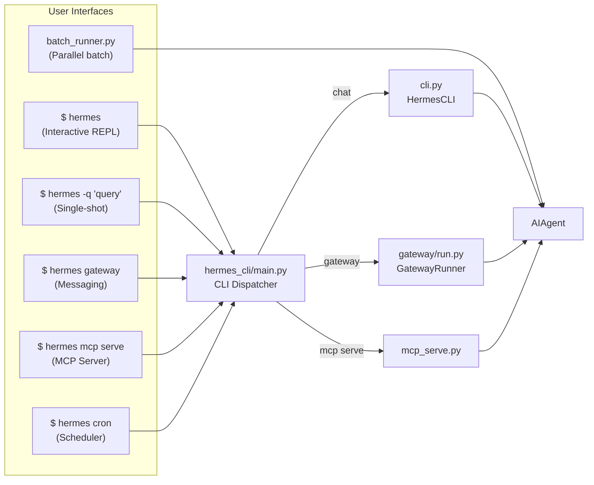

| Entry Point | File | Description |
|-------------|------|-------------|
| **Interactive REPL** | `hermes_cli/main.py` → `cli.py` | Rich terminal UI with autocomplete, spinner, skin engine |
| **Single-shot** | `hermes_cli/main.py` → `cli.py` | One query → one response, then exit |
| **Gateway** | `gateway/run.py` | Multi-platform messaging (Telegram, Discord, etc.) |
| **Batch Runner** | `batch_runner.py` | Parallel dataset processing with checkpointing |
| **MCP Server** | `mcp_serve.py` | Expose agent as MCP tool for Claude Desktop / editors |
| **ACP Adapter** | `acp_adapter/` | VS Code / Zed / JetBrains Copilot integration |
| **RL Environments** | `environments/` | Atropos-compatible RL training harness |
| **Cron Scheduler** | `cron/scheduler.py` | Periodic task execution |

**Profile isolation:** Before any imports, `_apply_profile_override()` in
`hermes_cli/main.py` sets `HERMES_HOME` to scope all state to the active
profile directory.

---

## 4. Core Agent Loop

The `AIAgent` class in `run_agent.py` is the heart of the system. It manages
the conversation loop, tool execution, context compression, and session
persistence.

### 4.1 Agent Lifecycle

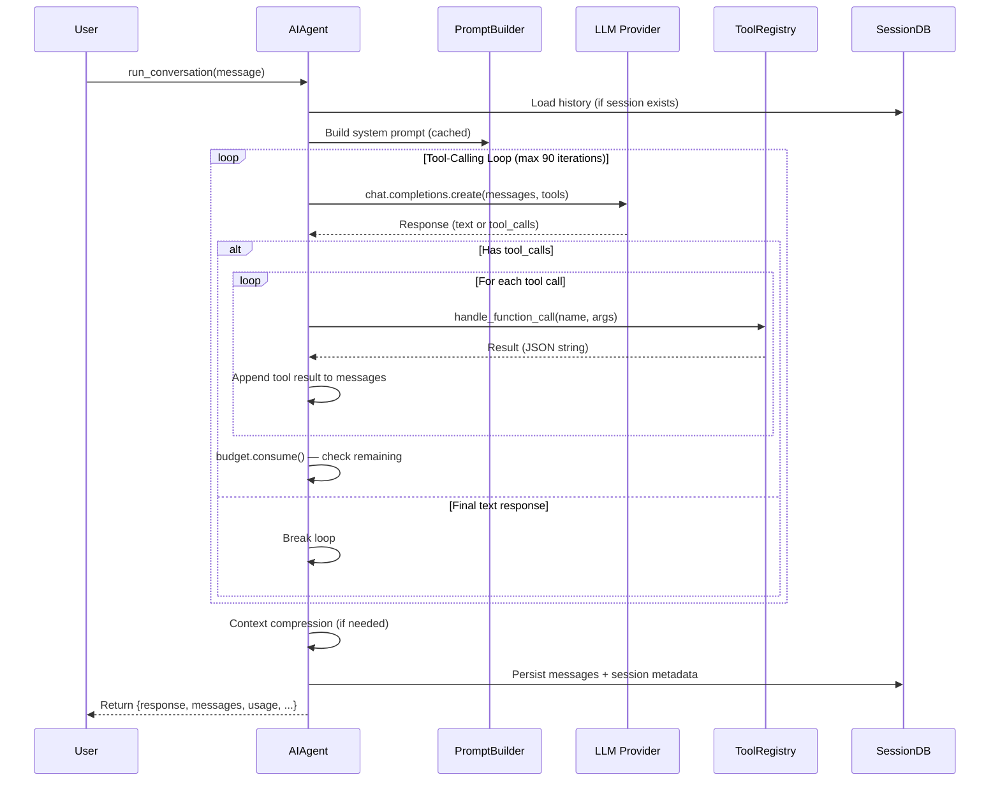

### 4.2 Key AIAgent Parameters

```python
class AIAgent:
    def __init__(self,
        model="anthropic/claude-opus-4.6",  # Model identifier
        max_iterations=90,                   # Tool-call budget
        enabled_toolsets=None,               # Whitelist toolsets
        disabled_toolsets=None,              # Blacklist toolsets
        session_id=None,                     # Resume session
        platform=None,                       # "cli", "telegram", etc.
        skip_memory=False,                   # Disable MEMORY.md
        skip_context_files=False,            # Disable AGENTS.md etc.
        save_trajectories=False,             # Export ShareGPT format
        # ... 40+ more params for callbacks, routing, credentials
    )
```

### 4.3 Iteration Budget

The `IterationBudget` provides thread-safe budget tracking with warning
thresholds:
- **70% consumed** → caution message injected into tool results
- **90% consumed** → urgent warning injected
- **100% consumed** → loop terminates

---

## 5. Tool System

### 5.1 Registry Architecture

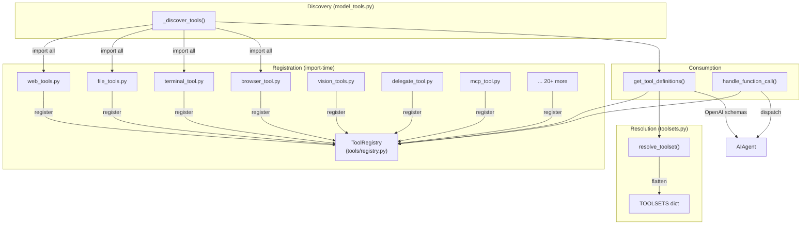

### 5.2 Tool Registration

Each tool file self-registers at import time — no central manifest required:

```python
# tools/your_tool.py
from tools.registry import registry

registry.register(
    name="example_tool",
    toolset="example",
    schema={"name": "example_tool", "description": "...", "parameters": {...}},
    handler=lambda args, **kw: example_tool(args),
    check_fn=check_requirements,      # Availability check
    requires_env=["EXAMPLE_API_KEY"],  # Required env vars
)
```

### 5.3 Complete Tool Inventory

| Toolset | Tools | Description |
|---------|-------|-------------|
| **web** | `web_search`, `web_extract` | Web research and content extraction |
| **files** | `read_file`, `write_file`, `patch`, `search_files` | Filesystem operations |
| **terminal** | `terminal`, `process` | Shell execution and process management |
| **browser** | `browser_navigate`, `browser_click`, `browser_type`, `browser_scroll`, `browser_back`, `browser_press`, `browser_get_images`, `browser_vision`, `browser_snapshot`, `browser_console` | Browser automation |
| **vision** | `vision_analyze` | Image analysis via auxiliary LLM |
| **image_gen** | `image_generate` | DALL-E 3 image generation |
| **skills** | `skills_list`, `skill_view`, `skill_manage` | Skill management |
| **code_execution** | `execute_code` | Sandboxed code execution |
| **delegation** | `delegate_task` | Sub-agent delegation |
| **mcp** | *(dynamic)* | MCP server integration |
| **memory** | `memory` | Persistent MEMORY.md |
| **todo** | `todo` | Task list management |
| **session** | `session_search` | FTS5 history search |
| **tts** | `text_to_speech` | Text-to-speech synthesis |
| **homeassistant** | `ha_list_entities`, `ha_get_state`, `ha_list_services`, `ha_call_service` | Smart home control |
| **messaging** | `send_message` | Cross-platform message sending |
| **cronjob** | `cronjob` | Scheduled task management |
| **moa** | `mixture_of_agents` | Multi-agent voting ensemble |

### 5.4 Toolset Composition

Toolsets can include other toolsets for composition:

```python
TOOLSETS = {
    "web": {"tools": ["web_search", "web_extract"], "includes": []},
    "research": {"tools": [], "includes": ["web", "files", "terminal"]},
    "full_stack": {"tools": [], "includes": ["research", "browser", "code_execution"]},
}
```

`resolve_toolset()` recursively flattens these to a final tool list.

---

## 6. Agent Internals

The `agent/` package contains modules that support the core agent loop.

```mermaid
graph TB
    AGENT["AIAgent<br/>(run_agent.py)"]

    subgraph "agent/ package"
        PB["prompt_builder.py<br/>System prompt assembly"]
        CC["context_compressor.py<br/>LLM-based summarization"]
        PC["prompt_caching.py<br/>Anthropic cache_control"]
        AUX["auxiliary_client.py<br/>Side-task LLM routing"]
        MM["model_metadata.py<br/>Context lengths, probing"]
        MD["models_dev.py<br/>models.dev registry"]
        DISP["display.py<br/>KawaiiSpinner, previews"]
        SC["skill_commands.py<br/>Skill slash commands"]
        TRAJ["trajectory.py<br/>ShareGPT export"]
        MMAN["memory_manager.py<br/>Memory block builder"]
        AA["anthropic_adapter.py<br/>Native Anthropic support"]
        UP["usage_pricing.py<br/>Cost estimation"]
    end

    AGENT --> PB
    AGENT --> CC
    AGENT --> PC
    AGENT --> AUX
    AGENT --> MM
    AGENT --> DISP
    AGENT --> TRAJ
    AGENT --> MMAN
    AGENT --> AA
    AGENT --> UP
```

### 6.1 System Prompt Assembly

`prompt_builder.py` constructs the system prompt from layered components:

```
┌─────────────────────────────────────────┐
│ 1. Identity (SOUL.md or default)        │
├─────────────────────────────────────────┤
│ 2. Tool Guidance                        │
│    • Memory guidance                    │
│    • Session search guidance            │
│    • Skills guidance                    │
├─────────────────────────────────────────┤
│ 3. Tool-Use Enforcement                 │
│    (tell model to call, not describe)   │
├─────────────────────────────────────────┤
│ 4. Model-Specific Guidance              │
│    (Google, OpenAI, Anthropic tweaks)   │
├─────────────────────────────────────────┤
│ 5. Memory Snapshot                      │
│    • MEMORY.md content                  │
│    • USER.md content                    │
├─────────────────────────────────────────┤
│ 6. Skills Index                         │
├─────────────────────────────────────────┤
│ 7. Context Files (threat-scanned)       │
│    • AGENTS.md, .cursorrules            │
├─────────────────────────────────────────┤
│ 8. Timestamp + Model Info               │
├─────────────────────────────────────────┤
│ 9. Platform Hints                       │
└─────────────────────────────────────────┘
```

The system prompt is built once per session and cached for Anthropic prompt
caching (75% cost reduction on multi-turn conversations).

### 6.2 Context Compression

When conversation history exceeds the context window threshold:

1. **Prune old tool results** (cheap, no LLM call)
2. **Protect head** (system prompt + first exchange)
3. **Protect tail** (last ~20K tokens)
4. **Summarize middle** turns with auxiliary LLM
5. **Iteratively update** summary on subsequent compactions

### 6.3 Auxiliary Client Router

Routes side tasks (compression, vision, web extraction) to the best
available LLM. Resolution chain:

```
OpenRouter → Nous Portal → Custom Endpoint → Codex OAuth →
Native Anthropic → Direct API (Kimi/GLM/MiniMax) → None
```

---

## 7. CLI Subsystem

### 7.1 CLI Architecture

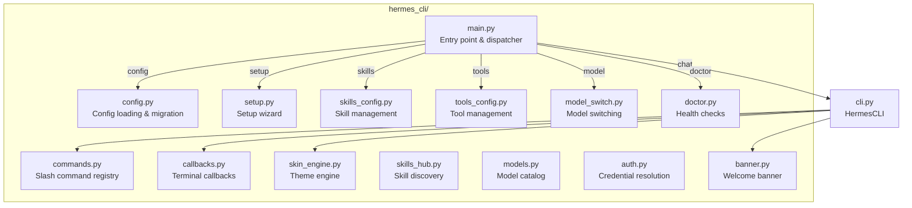

### 7.2 Slash Command Registry

All slash commands are defined centrally in `hermes_cli/commands.py` as
`CommandDef` objects. Downstream consumers derive automatically:

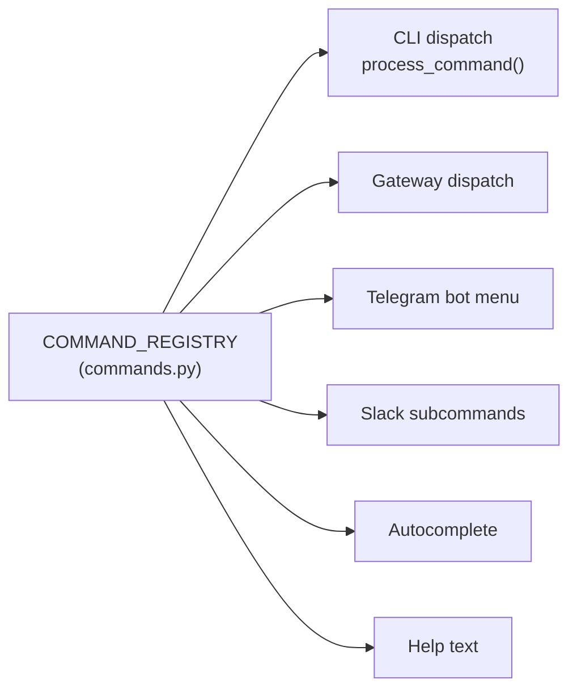

### 7.3 Skin Engine

The skin engine (`hermes_cli/skin_engine.py`) provides data-driven CLI
theming — pure data, no code changes needed:

| Element | Skin Key |
|---------|----------|
| Banner border color | `colors.banner_border` |
| Spinner faces | `spinner.thinking_faces` |
| Spinner verbs | `spinner.thinking_verbs` |
| Tool output prefix | `tool_prefix` |
| Agent name | `branding.agent_name` |
| Response box label | `branding.response_label` |

Built-in skins: **default** (gold/kawaii), **ares** (crimson), **mono**
(grayscale), **slate** (blue).

---

## 8. Gateway & Messaging Platforms

### 8.1 Gateway Architecture

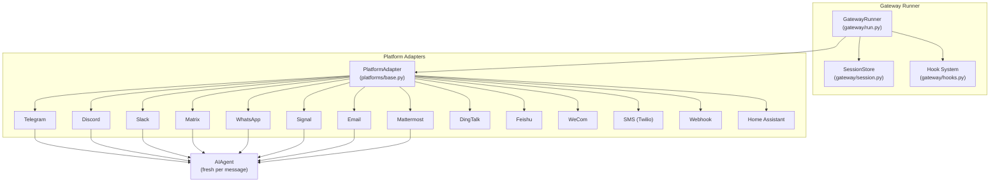

### 8.2 Message Flow (Gateway)

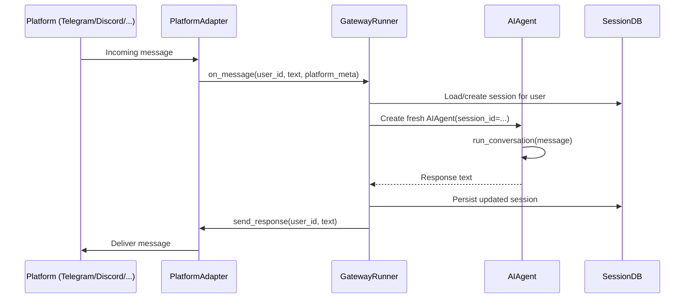

### 8.3 Platform Feature Matrix

| Platform | Threads | Reactions | Media | Groups | E2E Encryption |
|----------|---------|-----------|-------|--------|----------------|
| Telegram | — | ✓ | ✓ | ✓ | — |
| Discord | ✓ | ✓ | ✓ | ✓ | — |
| Slack | ✓ | ✓ | ✓ | ✓ | — |
| Matrix | — | — | ✓ | ✓ | ✓ |
| WhatsApp | — | — | ✓ | ✓ | ✓ |
| Signal | — | ✓ | — | ✓ | ✓ |
| Email | — | — | ✓ | — | — |

---

## 9. State & Persistence

### 9.1 Session Database

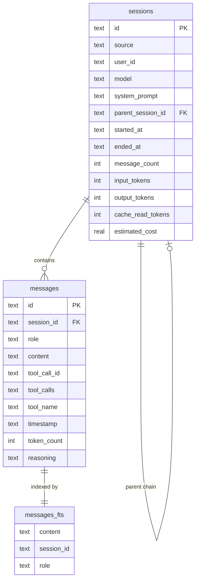

**Technology:** SQLite3 with WAL mode (concurrent reads + single writer)

**Features:**
- FTS5 full-text search across all messages
- Parent session chains (when compression splits sessions)
- Token counting and cost tracking per session
- Automatic session metadata updates

### 9.2 File-Based State

```
~/.hermes/                     # HERMES_HOME (profile-aware)
├── config.yaml                # All settings
├── .env                       # API keys
├── active_profile             # Sticky profile selection
├── sessions.db                # SQLite session database
├── MEMORY.md                  # Persistent agent memory
├── USER.md                    # User preferences
├── skills/                    # User-installed skills
│   └── SKILL.md               # Skills index
├── skins/                     # Custom YAML skins
├── auth.json                  # OAuth tokens
├── trajectories/              # Exported conversations
├── logs/                      # Application logs
└── profiles/                  # Profile directories
    └── <name>/                # Each profile = full ~/.hermes copy
```

---

## 10. Supporting Systems

### 10.1 Execution Environments

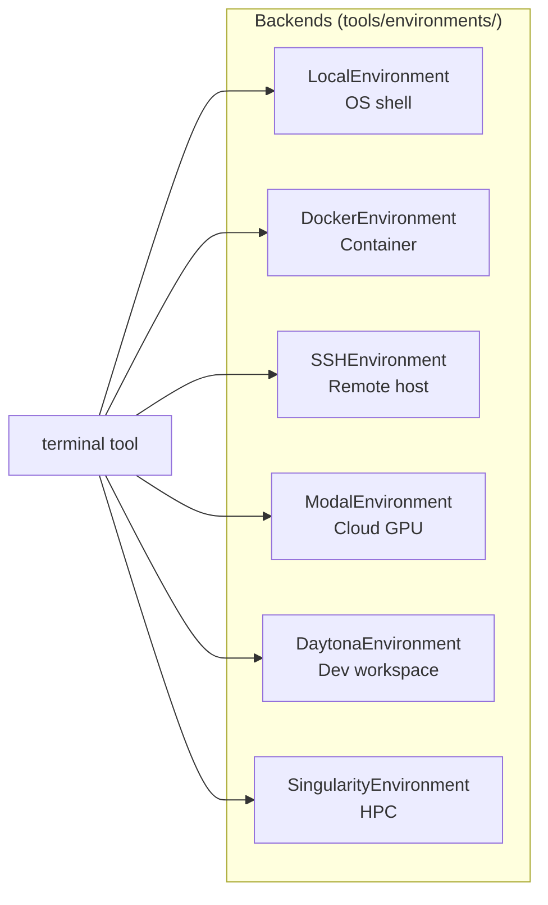

All backends implement a common interface: `execute(command) → (stdout, stderr, exit_code)`.

### 10.2 Skills System

Skills are user-created Python scripts stored in `~/.hermes/skills/` that
extend the agent's capabilities:
- Discovered via `SKILL.md` index
- Managed through `skill_manage` tool
- Injected as user messages (not system prompt) to preserve prompt caching

### 10.3 Plugin System

The `plugins/` directory supports extensibility:
- **Memory Providers** — custom backends (e.g., Honcho) implementing
  `MemoryProvider` interface
- **Hooks** — `pre_llm_call`, `on_session_start`, etc.

### 10.4 Cron Scheduler

`cron/scheduler.py` enables periodic task execution:
- Job definitions in `cron/jobs.py`
- Managed via `cronjob` tool or `hermes cron` CLI

### 10.5 RL Training Environments

The `environments/` package provides Atropos-compatible harnesses for
reinforcement learning:
- `hermes_base_env.py` — Base environment
- `hermes_swe_env/` — Software engineering tasks
- `web_research_env.py` — Web research tasks
- `terminal_test_env/` — Terminal interaction tasks

---

## 11. Configuration

### 11.1 Configuration Flow

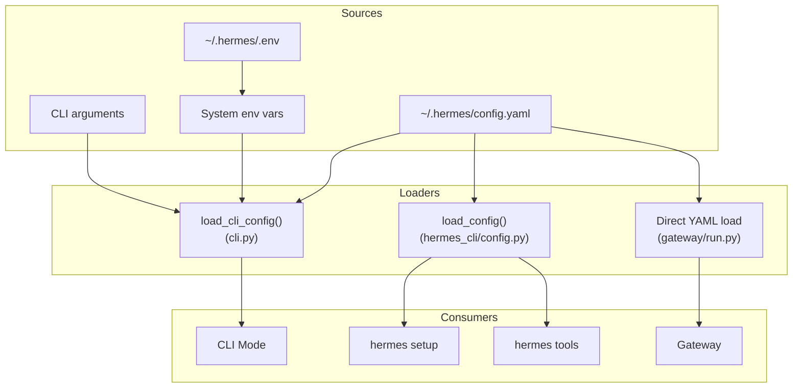

### 11.2 Key Configuration Sections

```yaml
model:
  model: "anthropic/claude-opus-4.5"
  base_url: "https://openrouter.ai/api/v1"
  provider: "openrouter"

agent:
  max_iterations: 90
  tool_use_enforcement: "auto"
  skip_context_files: false
  reasoning_effort: null

memory:
  memory_enabled: false
  provider: "honcho"

compression:
  enabled: true
  threshold: 0.50

display:
  skin: "default"
  tool_progress: true
  background_process_notifications: "all"

terminal:
  environment: "local"
  docker_image: null
  ssh_host: null
```

### 11.3 Config Migration

`hermes_cli/config.py` includes a `_config_version` (currently 5). When
bumped, existing users' configs are automatically migrated on next launch.

---

## 12. Data Flow — Message Lifecycle

The complete journey of a user message through the system:

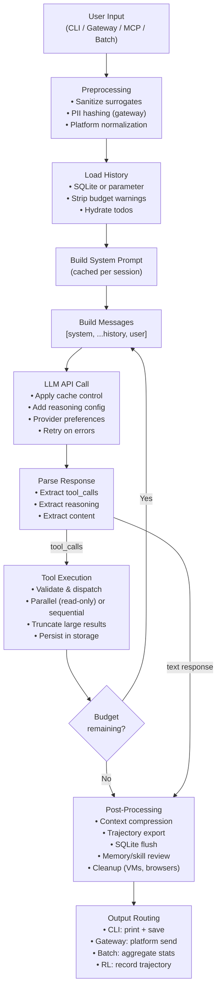

---

## 13. Key Architectural Patterns

| Pattern | Implementation |
|---------|---------------|
| **Self-Registration** | Tools register at import time via `registry.register()` — no central manifest |
| **Callback Injection** | UI layer (CLI/gateway) injects callbacks for tool events, streaming, status |
| **Profile Isolation** | `HERMES_HOME` env var scopes all state per profile |
| **Prompt Caching** | System prompt built once, reused across turns (Anthropic `cache_control`) |
| **Graceful Degradation** | Missing API keys disable tools rather than crash |
| **Persistent Event Loops** | Reused async loops prevent "Event loop is closed" errors |
| **Parallel Tool Execution** | Read-only tools dispatched in thread pool (8 threads) |
| **Layered Prompt Assembly** | System prompt built from composable layers |
| **Adapter Pattern** | Gateway platforms implement common `PlatformAdapter` interface |
| **Iteration Budget** | Thread-safe budget with caution/warning/hard-stop thresholds |
| **Context Compression** | LLM-based summarization when history exceeds threshold |
| **Config Migration** | Versioned config with automatic upgrade on launch |

---

## 14. Extension Points

### Adding a New Tool

1. Create `tools/your_tool.py` with `registry.register()` call
2. Add import in `model_tools.py` `_discover_tools()`
3. Add to `_HERMES_CORE_TOOLS` in `toolsets.py`

### Adding a Gateway Platform

1. Create `gateway/platforms/your_platform.py` extending `PlatformAdapter`
2. Implement `start()`, `on_message()`, `send_message()`
3. Register in gateway config

### Adding a Memory Provider Plugin

1. Create `plugins/memory/your_provider/__init__.py`
2. Implement `MemoryProvider` interface
3. Register via plugin system

### Adding a Slash Command

1. Add `CommandDef` to `COMMAND_REGISTRY` in `hermes_cli/commands.py`
2. Add handler in `HermesCLI.process_command()` in `cli.py`
3. Optionally add gateway handler in `gateway/run.py`

### Adding a Skin

Add to `_BUILTIN_SKINS` in `skin_engine.py` or drop a YAML file in
`~/.hermes/skins/`.

### Adding an Execution Environment

1. Create `tools/environments/your_env.py` extending base
2. Implement `execute(command)` interface
3. Register in terminal tool configuration
